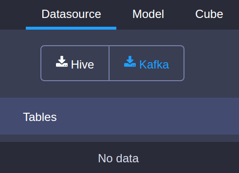
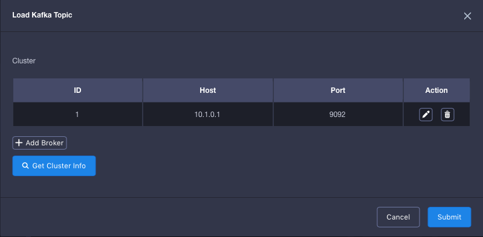
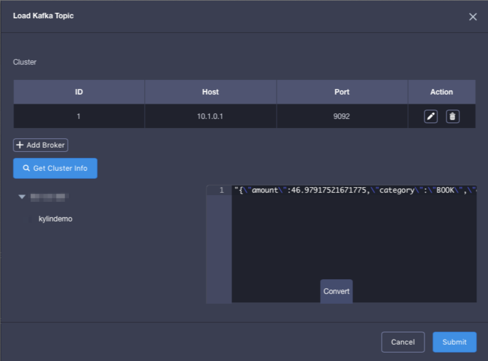
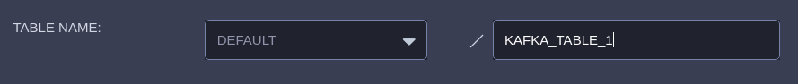
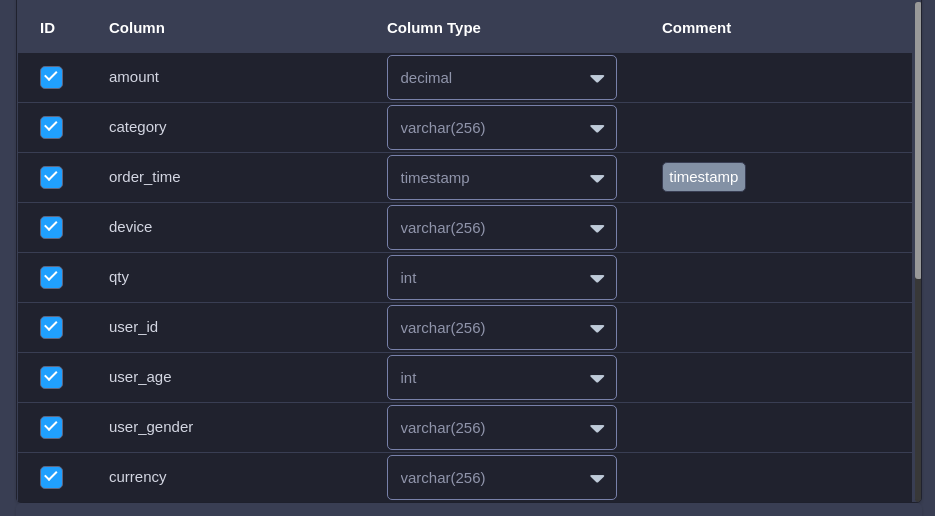
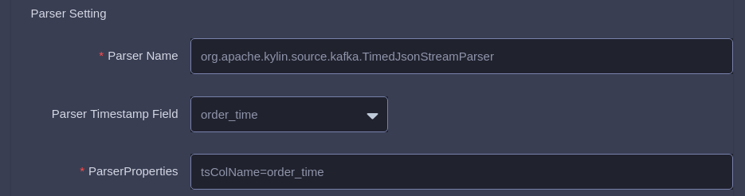

## Import Kafka Data Source
This section introduces how to import Kafka data source and define a table from streaming.

### Preparation

Before starting this tutorial, please make sure that you have already prepared a Hadoop environment which has installed **KAP 2.3** or above and **Kafka v2.10-0.10.1.0** or above. In this tutorial, we use Hortonworks HDP 2.4 Sandbox VM as the Hadoop environment.

It is unnecessary to deploy Kafka Broker and KAP in the same node. If Kafka Broker has not been deployed in KAP node, it is recommemded that you copy the Kafka binary package with the same version and extract it to any path of KAP's start node (such as: /usr/local/kafka_2.10-0.10.1.0), and set KAFKA_HOME to point to this path, thus ensuring there is a Kafka client library under the directory KAFKA_HOME/libs.

In this article, we assume that user has not installed Kafka Broker, and has not natively deployed and started Kafka Broker. User who has installed Kafka Broker may ignore this step.

```shell
curl -s 
https://archive.apache.org/dist/kafka/0.10.1.0/kafka_2.10-0.10.1.0.tgz | tar -xz -C /usr/local/
cd /usr/local/kafka_2.10-0.10.1.0/
./bin/kafka-server-start.sh config/server.properties &
```

Please make sure that the environment variable *KAFKA_HOME* has been exported successfully before KAP starts.

```Shell
export KAFKA_HOME=/usr/local/kafka_2.10-0.10.1.0
```

### Create sample Kafka Topic and simulate streaming data (Optional)

> Tips: The step to create Kafka Topic is optional. Users who have Kafka Topic may ignore this step.
>
> The following example assumes that Kafka Broker runs on 127.0.0.1:9092 and ZooKeeper runs on 127.0.0.1:2181. Users may change the IP address to their own address accordingly. 

Firstly, we create a topic named as "kylin_demo":

```shell
./bin/kafka-topics.sh --create --zookeeper 127.0.0.1:2181 --replication-factor 1 --partitions 3 --topic kylindemo
```

Secondly, we need to start a producer to continously put sample data to this topic. KAP has a Producer to produce data. Here we assume KAP is installed under ${KYLIN_HOME}.

```shell
cd $KYLIN_HOME
./bin/kylin.sh 
org.apache.kylin.source.kafka.util.KafkaSampleProducer --topic kylindemo --broker 127.0.0.1:9092
```

This tool sends 100 records to Kafka per second. Please keep it running during this tutorial. You can check the sample messages by running kafka-console-consumer.sh.

```shell
cd $KAFKA_HOME
bin/kafka-console-consumer.sh --bootstrap-server 127.0.0.1:9092 --topic kylindemo --from-beginning
```

### Define a table from streaming

1. Start KAP server, login KAP web GUI, select or create a project. Click **Studio -> Data Source**, then click the icon **Kafka**.

   

2.Input your broker info. Under the field **Host**, please fill in your own IP address which the Jobs run in YARN cluster can access.
   

3.Click √ to confirm your broker info, then click **Get Cluster Info -> sandbox -> kylindemo**, the kafka sample message would appear in the right box, click **Convert**.
   

4.You need to give a logic table name for this streaming data source. The name will be used for SQL query later. Here please enter "KAFKA_TABLE_1" in the **Table Name** field.
   

5.Review the table schema, make sure there is at least one column chosen as ”timestamp“.

   

6.Set parser

Parser Name: org.apache.kylin.source.kafka.TimedJsonStreamParser (default), you can also use customized parser

Parser Timestamp Field: you are required to set a timestamp field for the parser. In this example, we use order_time

ParserProperties: Properties of the parser should as least include the timestamp field. In this example, tsColName=order_time. You can further define customized properties.



7.click **Submit**.