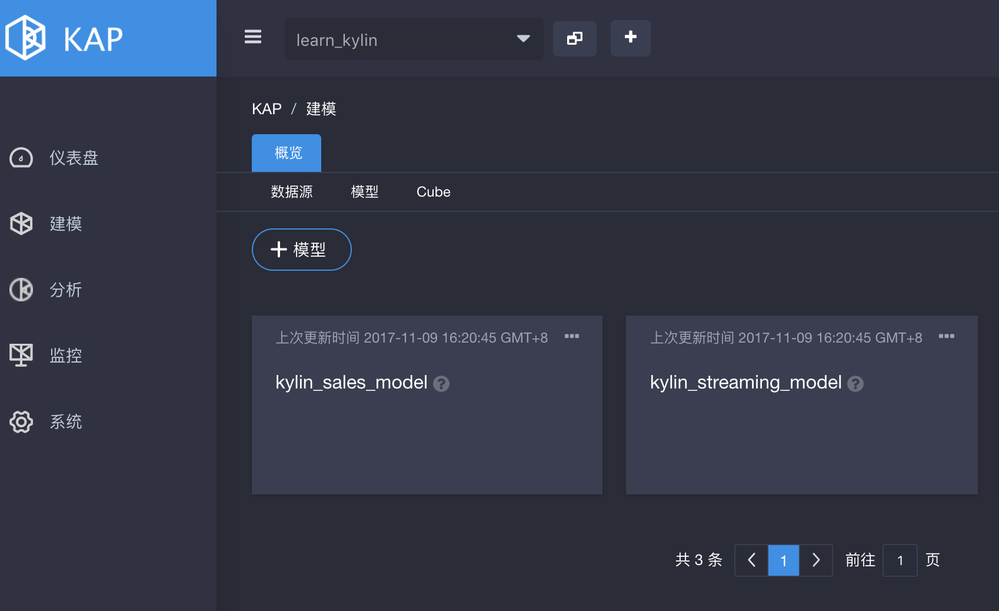
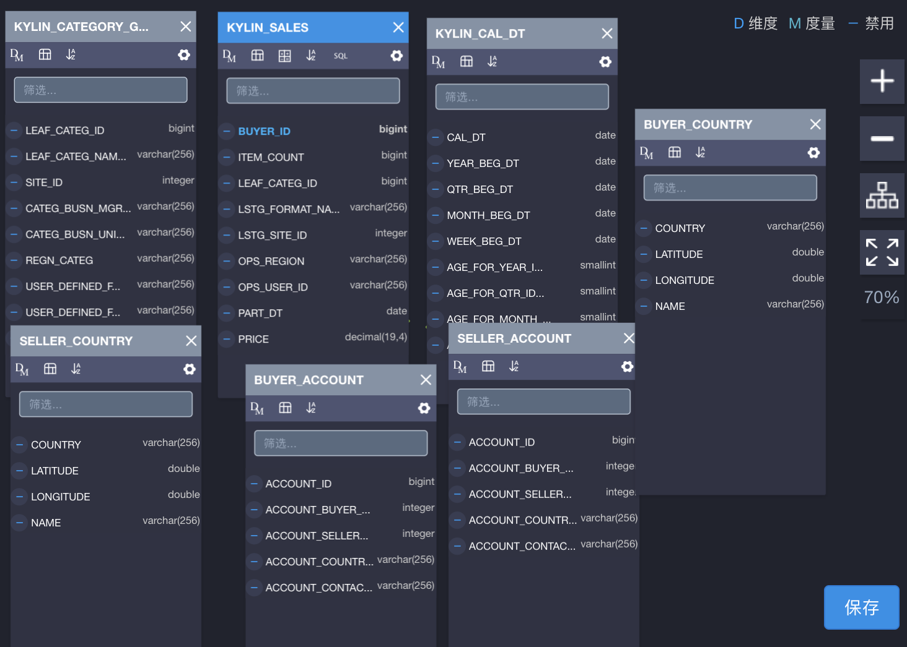
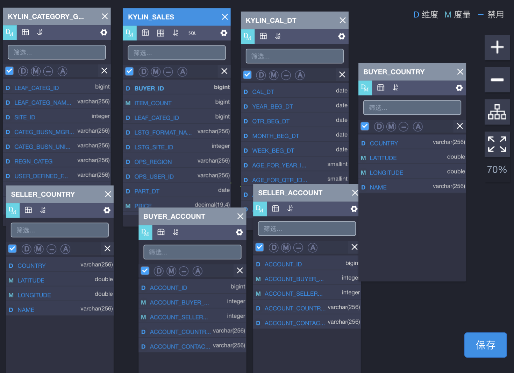
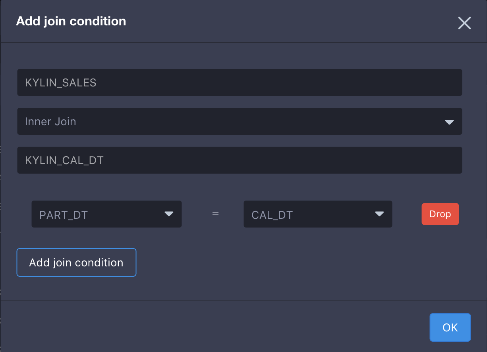
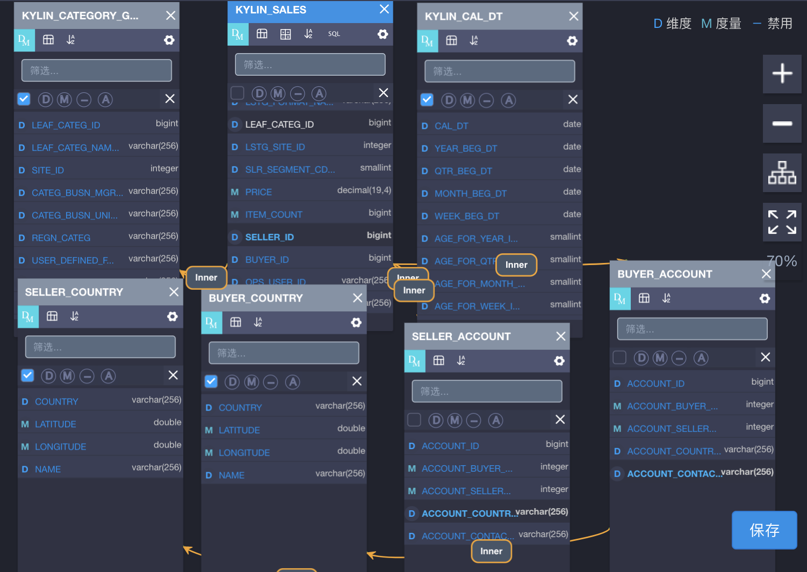
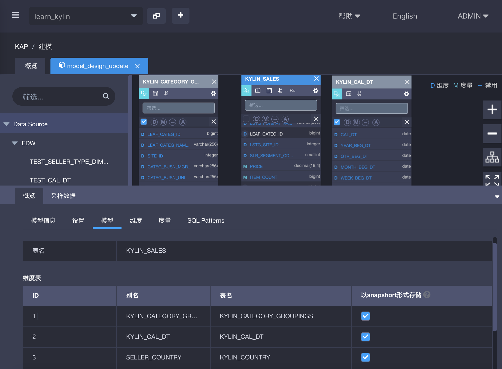

## 设计模型
在数据源就绪的基础之上，我们开始设计模型。以KAP自带的数据集为例，该数据集的数据模型包含一张事实表和四张维度表，表间通过外键进行关联。实际上，并不是表上所有的字段都有被分析的需要，因此我们可以有目的地仅选择所需字段添加到数据模型中。然后，根据分析师用户的具体分析场景，把这些字段设置为维度或度量。

### 创建步骤
第一步，打开KAP的Web UI，在左上角项目列表中选择刚刚创建的*learn_kylin*项目，然后进入“模型”页面，并创建一个模型。

第二步，为模型选择事实表 (*Fact Table*) 和维度表 (*Lookup Table*)（有关维度表存储方式，见后文的[详细操作及提示](#详细操作及提示)）。操作步骤如下：

1. 为建立下文所需的雪花模型，从左边的源表中，将希望用来建模的表拖至建模画布（页面中央），首先，将 `KYLIN_SALES` 表拖至画布；
2. 单击 `KYLIN_SALES` 表右上角的设置图标，将该表的类型设为事实表；
3. 选中并将以下维度表拖至画布 (`KYLIN_CAL_DT`, `KYLIN_CATEGORY_GROUPINGS`,`KYLIN_ACCOUNT`, `KYLIN_COUNTRY`)；其中`KYLIN_ACCOUNT` 拖出两次，将名称分别更改为`SELLER_ACCOUNT`和`BUYER_ACCOUNT`，`KYLIN_COUNTRY`也拖出两次，分别命名为`SELLER_ACCOUNT`和`BUYER_ACCOUNT`。

第三步，设置维度和度量 (DM)。从KAP 2.5.4开始，对于维度和度量，可以单个选择或批量选择，也可使用系统推荐的设置。在本例中，我们选择系统推荐的维度和度量。更多操作，见后文[详细操作及提示](#详细操作及提示)。

操作步骤：

1. 单击图标左上角的 `DM` 展开 DM 设置工具条。工具条上的图标 `D` 表示维度，`M` 表示度量，`—` 表示禁用，`A` 表示使用系统推荐的维度和度量。
2. 勾选工具条上最右边的复选框，可选中所有列，将它们批量设置为维度 `D` 或度量 `M`，或选择 `A` 使用系统推荐的维度和度量。也可根据需要选择所需的列单独进行设置。本例中我们选中所有列，然后选择 `A` 。

第四步，建立表连接关系。在KAP2.5系列中，表与表关系的建立可以通过拖拽表上的列完成。当你希望建立一个表连接（join），从事实表（外键所在表）指向维度表（主键所在表），比如，“KYLIN_SALES *Inner Join* KYLIN\_CAL\_DT on KYLIN\_SALES.PART_DT=KYLIN\_CAL\_DT.CAL\_DT”, 则将`PART_DT`从`KYLIN_SALES`拖至`KYLIN\_CAL\_DT`，如下图所示的窗口将会弹出。

参照以上方法，设置好所有连接条件（如下所示）：

1. KYLIN_SALES *Inner Join* KYLIN\_CAL\_DT 

   连接条件：

   DEFAULT.KYLIN\_SALES.PART_DT = DEFAULT.KYLIN\_CAL\_DT.CAL\_DT

2. KYLIN_SALES *Inner Join* KYLIN\_CATEGORY_GROUPINGS 

   连接条件：

   KYLIN_SALES.LEAF_CATEG_ID=KYLIN\_CATEGORY\_GROUPINGS.LEAF_CATEG_ID

   KYLIN_SALES.LSTG_SITE_ID=KYLIN\_CATEGORY\_GROUPINGS.SITE_ID 

3. KYLIN_SALES *Inner Join* BUYER_ACCOUNT (alias of KYLIN_ACCOUNT)

   连接条件：

   KYLIN_SALES.BUYER_ID=BUYER_ACCOUNT.ACCOUNT_ID 

4. KYLIN_SALES *Inner Join* SELLER_ACCOUNT (alias of KYLIN_ACCOUNT) 

   连接条件：

   KYLIN_SALES.SELLER_ID=SELLER_ACCOUNT.ACCOUNT_ID 

5. BUYER_ACCOUNT (alias of KYLIN_ACCOUNT) *Inner Join* BUYER_COUNTRY(alias of KYLIN\_COUNTRY) 

   连接条件：

   BUYER_ACCOUNT.ACCOUNT_COUNTRY=BUYER_COUNTRY.COUNTRY 

6. SELLER_ACCOUNT (alias of KYLIN_ACCOUNT) *Inner Join* SELLER_COUNTRY(alias of KYLIN\_COUNTRY)

   连接条件：

   SELLER_ACCOUNT.ACCOUNT_COUNTRY=SELLER_COUNTRY.COUNTRY

下图是设置好之后的界面（单击连接中的标志（join），可以展开连接具体内容）：

第五步，单击“保存”并设置日期类型的时间分段。一般来说，销售数据都是与日俱增的，每天都会有新数据通过ETL到达Hive中，需要选择增量构建方式构建Cube，所以需要选择用于分段的时间字段DEFAULT.KYLIN_SALES.PART_DT。根据样例数据可以看到，这一列时间的格式是yyyy-MM-dd，所以选择对应的日期格式。此外，我们既不需要设置单独的分区时间列，也不需要添加固定的过滤条件。设置效果如下图所示。

最后，单击“提交”按钮，到此数据模型就创建成功了。

### 详细操作及提示

#### 关于维度表存储形式

如果要设置数据存储形式，可依次单击`概览`和`模型`，这样会显示所选的事实表和维度表。默认当维度表小于 300M 时，表以 snapshot 形式存储，以提高查询效率；当维度表大于 300M 时，KAP 通常不支持以 snapshot 形式存储。此时，如果要以 snapshot 形式存储较大维度表，可在 kylin.properties 中更改 snapshot存储的限制（具体调整请联系tech support: kybot.io）。

#### 选择维度及度量

在建立连接后，可继续根据需要选择作为维度 (D: Dimension) 和度量 (M: Measure) 的字段。单击**概览**，将显示维度和度量选项卡。单击维度或度量对应的 X 号，可删除此维度或度量。通常，时间会用来作为过滤条件，所以一般会选择时间字段。此外，还会选择商品分类、卖家ID等字段为维度。

一般地，PRICE字段用来衡量销售额，ITEM_COUNT字段用来衡量商品销量，SELLER_ID用来衡量卖家的销售能力。选择度量字段后的结果如下图所示：
